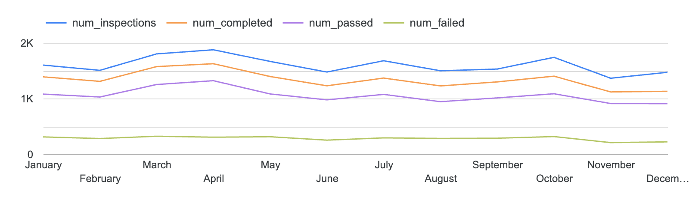

# chi_inspections
Data Engineering Zoomcamp 2026 Project


# The Problem
This workflow aims to build a pipeline from the City of Chicago’s data portal to a big query data warehouse and dashboard. The pipeline will load, validate, and re-structure this data.

## Project Goals
- Create an end-to-end ELT process ending with a simple report
- Make it replicable for peer review with easy-to-follow documentation and ~15 minute workflow
- Explore the Chicago Data Portal

## Tools & Approach
In order to accomplish these goals, I plan to use the following tools:
- Github codespaces as an easy replicable virtual environment 
- Create Python environment in uv for replicable package management 
- Orchestrate ELT and testing with Bruin
- Utilize BigQuery and Google Looker for storage, analysis, and reporting
- The workflow was  built in Github Codespaces, using codespace secrets for a clean environment and replicability

# The Data

## Chicago Data Portal

The City of Chicago maintains a large library of public datasets in a variety of formats.  Many of these are accessible through their SODA3 API.  The data from this project is sourced from the following Food Inspections Since 07/01/2018 dataset.

This metadata page provides a description of the dataset, columns, datatypes, and the api url.

[Food Inspections Metadata](https://data.cityofchicago.org/Health-Human-Services/Food-Inspections-7-1-2018-Present/qizy-d2wf/about_data)

More information on understanding the data is available here:  

[Food Inspection Data Description](docs/foodinspections_description.pdf)

# Recreating this Data Pipeline

## Initial Setup

This project is intended to be run in Github Codespaces for quick replicability.  

Feel free to create a fork of this repository or use github importer to make a disconnected copy in your github.  I've built this so that you can easily replicate this workflow the Github Codespaces. If you follow this path, all of the tools needed will be installed using the .devcontainer.json file and you will provide all credentials needed through codespace secrets.  

It is possible to run this process on a standalone virtual machine with minimal changes.  Instead of storing secrets in github, you would store them as environment variables. 

Before getting started, you will need to have your own google cloud platform account. The files are of relatively trivial size and it is not a highly computational process.  You will also be required to provide information to sign up for a free API account with the City of Chicago (described below)

## Credentials

### Google Cloud Platform

You will need to create service account credentials by following the instructions [here](https://developers.google.com/workspace/guides/create-credentials).  


You will need to provide the GCP Service Account the following minimum privileges:
 - roles/bigquery.dataEditor 
 - roles/bigquery.jobUser 
 - roles/bigquery.dataViewer 
Or, you can simply assign the BigQuery Admin role.  

### Chicago Data Portal API

In order to call the API, you will need to have an api key. You can do this by visiting the [developer page](https://data.cityofchicago.org/profile/edit/developer_settings). 

1. Click create new account at the bottom and fill out your account information 
2. When requested, verify your address and [sign in](https://data.cityofchicago.org/login )
3. Now, your username will appear on the top right.  Click on your username drop down and go to [Developer Settings](https://data.cityofchicago.org/profile/edit/developer_settings)
4.  Now you should see a button to create a new API key.  Copy the secret in a safe place for now so that you can save it in to github secrets.

### Storing Credentials

In order to safely store secrets in this project, I am using codespace secrets that act as environment variables within the VM.
1.  Login to github in your browswer, open your copy of this repo, and go to settings in the upper right 
2.  Under  Security there is "Secrets and variables" header.  Click on Codespaces.


3.  Create the following 4 codespace secrets in this repo:

 **Your GCP credentials**

 Service Account
  - Name:  GCP_SERVICE_CRED
  - Secret:  _The contents of your ETL service account json_

Project ID
  - Name:   GCP_PROJECT_ID
  - Secret:  _The project id associated with the above service accounts (looks like random-word-1234-a2)_

**Your Chicago Data Portal credenials**

  - Name:  CHI_API_ID
  - Secret:  _The API Key ID provided by data.cityofchicago.org_
  
  - Name:  CHI_API_SECRET
  - Secret:  _The API Key Secret provided by data.cityofchicago.org_

  ## The Pipeline
  ### Bruin
  This project uses Bruin to orchestrate the following tasks in our ELT pipeline:
   - Resource Allocation:  Bruin will create three datasets in BigQuery for our tables:  ingest, stage, report.
   - Extraction:  Using a python script, Bruin will run the an API call to the Chicago Data Portal and download a csv of the raw inspection data.
   - Load:  Bruin will create a bigquery table and load our raw data.   
   - Transformations:  We will shape that data in Big Query into three staging tables and two reporting tables.
   - Quality Checks:  Bruin will run 20 quality checks to help us identify any issues.  

  ### Running the Pipeline

  Once you have copied this repo and loaded the credentials, you should have everything you need to run the pipeline:
  1.  In your repo in github, click the green "Code" button and click "create a codespace on main".


  The first run may take longer as it build the devcontainer and installs dependencies.


  2.  The developer environment will open.  If you like, you can run in browser or [switch to an IDE like VSCODE](https://docs.github.com/en/codespaces/developing-in-a-codespace/using-github-codespaces-in-visual-studio-code)

  3.  In the terminal, run 

  ```
  bruin run food-inpections
  ```

  On the first run it will take longer as bruin uses uv to load dependencies.  

To learn more about this process, go to [food-inspections/README.MD](food-inspections/README.md)

##The Report

I am using Google Data Studio to show results.

You can see my report [here](https://datastudio.google.com/s/gOLV-FVKGrk) or see a pdf copy in [docs/report_2026_sofar.pdf](docs/report_2026_sofar.pdf).  My report will remain accessible through 2026.

The report uses the report.inspections_by_month and report.inspections_by_licensee tables created in the pipeline.

Three charts show monthly data from ispections_by_month, for example this show inspection trends for 2025:

On the live report, choose the year(s) you want to evaluate using the year dropdown at the bottom of the clipboard on the top left.

And a graphic on the left provides the "Worst Offender" of the last six months from the inspections_by_licensee table.


You can change the period at the bottom of this clipboard.

## Recreating the Report


